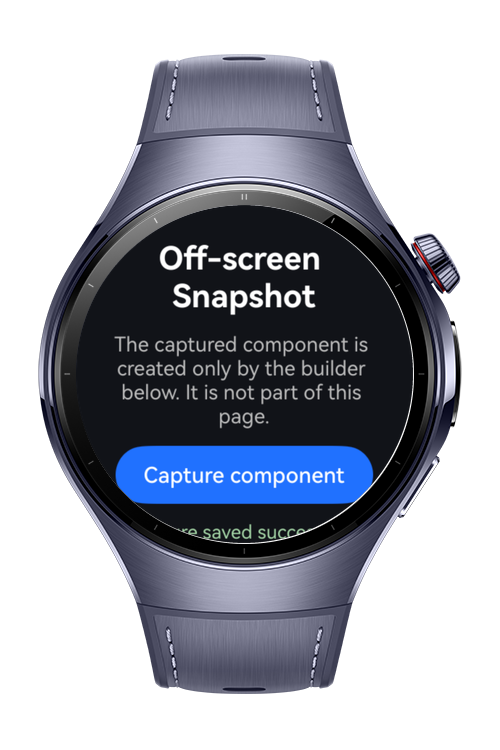
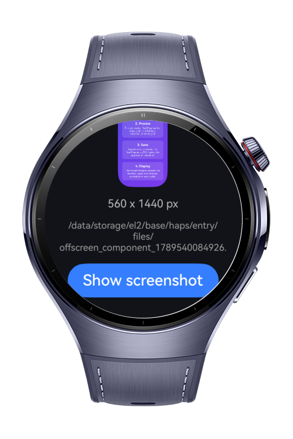

> **Note:** To access all shared projects, get information about environment setup, and view other guides, please visit [Explore-In-HMOS-Wearable Index](https://github.com/Explore-In-HMOS-Wearable/hmos-index).

# How To Capture Offscreen Screenshot

A practical off-screen component screenshot sample for HarmonyOS Next smart wearables. The app demonstrates how to use `UIContext.ComponentSnapshot.createFromBuilder` to render an ArkUI component that is not part of the visible component tree, receive the result as a `PixelMap`, save it as a JPEG in the application sandbox, and display the saved long screenshot on a separate scrollable page. The codelab teaches how to generate and process UI previews without first presenting their source components on screen.

# Preview

<div>
  
  
</div>

# Use Cases

- **Off-Screen Component Rendering**: Demonstrates how to render a component defined by an `@Builder` without adding it to the currently displayed component tree.
- **Screenshot Processing and Persistence**: Shows how to inspect the generated `PixelMap` and encode it as a JPEG with `ImagePacker` inside the application sandbox.
- **Scrollable Long Screenshot Preview**: Illustrates reopening the saved image on another page, preserving its aspect ratio, and displaying tall content inside a wearable-friendly `Scroll` container.

**Target APIs**

| Module | Method | Role |
|---|---|---|
| UIContext.ComponentSnapshot | `createFromBuilder` | Renders an off-screen builder and returns the result as a `PixelMap` |
| PixelMap | `getImageInfoSync` / `release` | Reads image dimensions and releases image resources |
| ImagePacker | `packToFile` | Encodes the generated `PixelMap` as a JPEG file |
| image | `createImageSource` / `createPixelMap` | Reopens the saved screenshot for display on the preview page |
| fileIo | `openSync` / `closeSync` | Opens and closes screenshot files in the application sandbox |
| Navigation / NavPathStack | `pushPathByName` / `pop` | Navigates to the screenshot destination and passes the saved file path |

# Technology

## Stack
- **Languages**: ArkTS, ArkUI
- **Frameworks**: HarmonyOS SDK 6.1.1(24)
- **Tools**: DevEco Studio Version 6.1.1.280
- **Libraries & Kits**:
  - `@kit.ArkUI` — ComponentSnapshot and Navigation components
  - `@kit.ImageKit` — PixelMap, ImageSource, and ImagePacker operations
  - `@kit.CoreFileKit` — File access in the application sandbox
  - `@kit.AbilityKit` — UIAbilityContext and application directory access
  - `@kit.BasicServicesKit` — BusinessError handling

## Required Permissions
- No additional permissions are required. Screenshots are saved inside the application sandbox.

# Directory Structure
```
entry/src/main/
├── ets/
│   ├── entryability/
│   │   └── EntryAbility.ets        // Main UIAbility entry point
│   └── pages/
│       ├── Index.ets               // Off-screen builder, capture, processing, and save flow
│       └── Screenshot.ets          // Scrollable long screenshot preview page
└── resources/base/
    ├── element/
    │   ├── color.json              // UI color resources
    │   └── string.json             // UI text and formatted message resources
    └── profile/
        └── main_pages.json         // Application page registration
```
# Constraints and Restrictions

## Supported Device
- Huawei Watch 5
## Requirements
- HarmonyOS API level 24 or higher
- DevEco Studio 6.1.1 or later
- Enough application sandbox storage for the encoded screenshot
# License
How to Capture Off-Screen Component Screenshots for HarmonyOS is distributed under the terms of the [LICENSE](./LICENSE).
